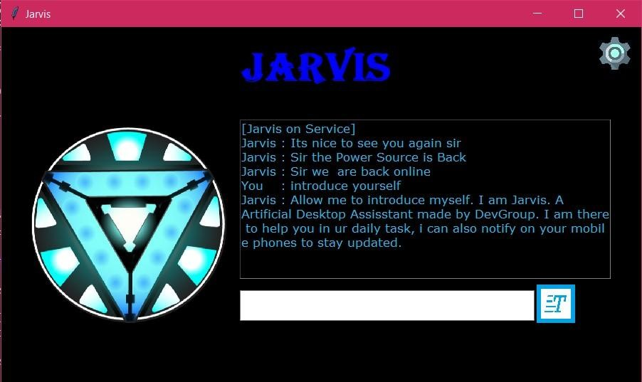
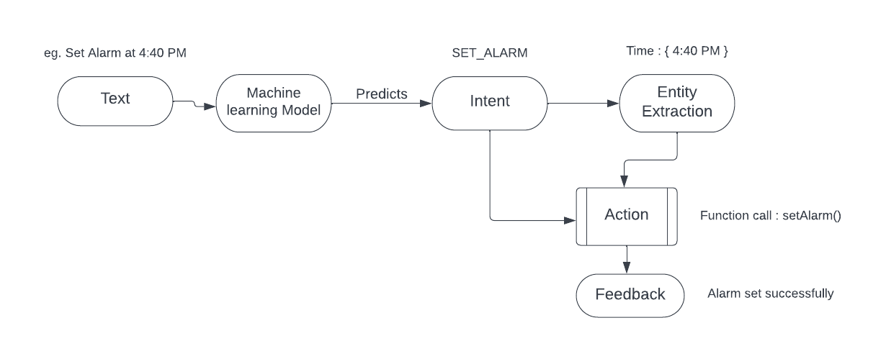

# Jarvis Virtual Assistant(Windows)

- Jarvis is virtual personal assistant for Windows Desktops which helps users to perform their daily task and keep them update to date with latest information.
- User can interact with Jarvis its amazing GUI  in 3 different ways : Text, Voice, Mobile App.
- Its can do more than 30+ task and alert you about your system status vai notification. ( Check task.txt )

  

# How it works?

- As said user can interact in 3 ways: Text, Voice, Mobile App, so everything comes down to text.
- This text given to machine learning model to predict Intent.
- This Intent is passed along with text to next phase for Entity extraction if required.
- Finally the extracted data  and intent is passed to Action module.
- Action module perform the task and give feedback to user vai computer generated voice.

Jarvis also checks for system status events like Battery Low/Full, Network connection, External device plugged, New email updates, etc and notify user.

# Installation
See requirements.txt

# Requirement
- Python 3.4+ 
- Windows 10 and later
